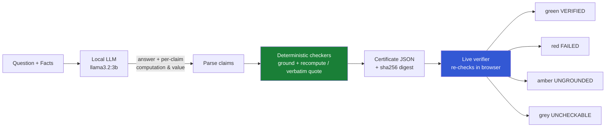

# Proof-Carrying AI

An answer that ships a **checkable receipt**. A local LLM answers a question and, per
claim, states the exact evidence behind it — the arithmetic for a number, or a verbatim
quote for a fact. Deterministic checkers — **no model in the verdict path** — recompute
every claim. A live verifier lights each claim **green / red / amber / grey** and shows a
coverage denominator: how much of the answer was checkable at all.

The point: an answer you don't have to take on faith. The verifier never trusts the
model's self-report; it re-derives every verdict itself — in Python, and independently
in the browser.

> **Status: research prototype.** Local, zero third-party dependencies, honestly scoped.
> Read **What this is not** before relying on it.

## What this is / is not

**It is** a working loop where a local model's claims are checked by deterministic,
model-free checkers, bundled into a portable **signed** certificate, and re-verified live
in the browser — across two domains (arithmetic and retrieval), single answers, and
multi-step agent trajectories.

**It is not:**

- **Not proof an answer is true about the world.** A VERIFIED claim is grounded to a
  source or a computation, not to reality. A correct computation on the wrong operands, or
  a real quote that does not support its point, can still verify.
- **Not a semantic checker.** It confirms a quote is present and arithmetic is right — not
  that the evidence actually supports the claim's meaning. That would need a model, which
  would break the model-free guarantee.
- **Not public-key signed.** The HMAC signature is shared-key authenticity: the verifier
  needs the same secret, and anyone holding it can forge. Public, anyone-can-verify signing
  (Ed25519) is future work.
- **Not a general agent framework.** The trajectory demo is a scaffold that demonstrates the
  chain property, not a production planner.

## Try it with no install

Open **[demo.html](demo.html)** in any browser. No Ollama, no Python, no build step — the
page recomputes every verdict and the entire agent chain locally in your browser.

Two real examples are embedded, both produced by the pipeline in this repo:

- **Agent trajectory** — retrieve a figure from a source, then compute with it. Press
  *misquote it* on step 1 and watch the whole trajectory flip to BROKEN: step 2's own claim
  stays green while its chain chip goes red, because the number it used was never actually
  established. That gap is the thing per-step checking cannot see.
- **Single certificate** — one answer spanning both domains, showing all four verdicts.

The samples are signed with the **public demo key** in `examples/demo_signing.key`. That key
has zero security value; it is published so you can run the verifier yourself:

```
python3 cli.py --verify examples/sample_trajectory.json --key examples/demo_signing.key
python3 cli.py --verify examples/sample_certificate.json --key examples/demo_signing.key
```

Publishing that key also makes the shared-key limitation concrete: to let you verify, the key
had to be shared — and anyone holding it can now forge. That is precisely why HMAC is
authenticity *within a trust domain* and not a public signature.

Rebuild the demo after regenerating artifacts: `python3 tools/build_demo.py`.

## The loop



The model is the **only** place a model is involved. It *proposes* claims; the
checker *disposes*. No model output sits in the verdict path.

## Run it

Requires Python 3 and a local [Ollama](https://ollama.com) with `llama3.2:3b`
(`ollama pull llama3.2:3b`). No API keys, no cloud, no third-party Python packages.

```
python3 cli.py --demo          # arithmetic domain (Q1 costs)
python3 cli.py --demo-facts    # retrieval domain (quotes vs. sources)
python3 cli.py --demo-mixed    # one certificate spanning BOTH domains
python3 cli.py --demo-agent    # verified-value trajectory chain: a signed receipt per step + chain check
```

Each asks the local model, writes `examples/demo_certificate.json`, and renders
`verify.html`. Open `verify.html` in a browser and edit any field — badges re-check
live, because the browser is an *independent* second verifier (both checkers are
reimplemented in JS, no dynamic evaluation).

Re-check any certificate from the terminal (no model involved):

```
python3 cli.py --verify examples/demo_certificate.json
```

Run the checker tests:

```
python3 tests/test_checker.py
```

## Two checkable domains, one schema

Claims come in two kinds, checked by two model-free checkers, sharing one
certificate, one coverage denominator, and one UI:

- **arithmetic** (`CLAIM:`) — operand grounding + recompute (below).
- **retrieval** (`FACT:`) — the claim carries a quoted span and a source id; the
  checker verifies the span appears **verbatim** (whitespace- and case-normalized)
  in the cited source. VERIFIED = quote is in the source; FAILED = source exists but
  the quote is not in it (fabricated/misquoted); UNGROUNDED = the cited source id is
  not in the corpus (invented source); UNCHECKABLE = no quote/source. This grounds
  the quote to the source, not the source to reality — the same discipline as
  agent-trace-shield.

## What an arithmetic verdict means (and does not)

Each arithmetic claim is checked on two independent axes: **grounding** (does every
operand trace to a given fact or a value a prior grounded claim derived?) and
**arithmetic** (does the asserted number equal the recompute?).

- **VERIFIED (green):** operands grounded **and** asserted equals the recompute. It is
  grounded to the facts and the computation — **not** proven true about the world.
- **FAILED (red):** operands grounded, but the asserted number does not match the recompute.
- **UNGROUNDED (amber):** an operand is not in the facts and was not derived by a prior
  claim — the model invented a number. Caught even when its arithmetic is internally correct.
- **UNCHECKABLE (grey):** there was no computation to check. **Counted**, never hidden.
  `coverage_ratio = checkable / total` (checkable = verified + failed + ungrounded)
  reports how much of the answer was checkable at all. High verified count + low
  coverage = a weak certificate.

**Grounding is a provenance chain.** An operand is grounded if it appears in the facts
OR equals a value an earlier grounded claim derived — and the value threaded forward is
the one the *checker recomputed*, never the one the model asserted. So a fabricated
number stays ungrounded even if the model reuses it downstream. Known v0.2 limits:
ambient constants not in the facts (e.g. `100` for a percent, `12` for months) are
flagged ungrounded on purpose (unknown provenance = flagged, not assumed), and claims
are checked in emitted order (a claim that references a later claim's result is not
grounded by it).

## Integrity and authenticity

The `digest` is a sha256 over the certificate's signable content: an **integrity**
check. On its own it is forgeable — anyone can edit the content and recompute the
digest to match.

The `signature` (when present) is an **HMAC-SHA256** over the digest, keyed by a local
secret (`~/.pcai/signing.key`, created on first run, 0600). It proves the certificate
was made by a holder of the key. `python3 cli.py --verify cert.json` reports
`digest_ok` and `signature: valid | invalid | present-but-no-key | unsigned`. A
forger who tampers content and recomputes the digest still gets `signature: invalid`,
because they cannot HMAC it without the key (and the tampered claim also flips its
verdict on re-check).

Honest scope: this is **shared-key** authenticity — the verifier needs the same secret,
and anyone holding it can forge. It is **not** public, anyone-can-verify signing;
that needs a crypto dependency or a from-scratch Ed25519, on the expansion path.

## Verified-value trajectory chain (multi-step agents)

> **Naming note (see `RELATED_WORK.md`):** "Proof-Carrying Agent Actions" (PCAA, arXiv 2606.04104,
> June 2026) predates this feature's name in the agent niche and is a DIFFERENT mechanism — PCAA
> certifies that an action was routed/reviewed/APPROVED (governance), while this feature certifies
> that a step's CONTENT is grounded and its numbers trace to verified prior steps (correctness).
> Complementary layers; this feature is named the verified-value trajectory chain, and the
> proof-carrying-agents phrase is not used as a name here (PCAA coined it in this niche).

An agent takes several steps toward a goal; **each step emits its own signed
certificate**, and later steps may use only numbers an earlier VERIFIED step
established (a correct computation's result, or a number quoted verbatim from a
real source). `pcai/agent.py` runs the trajectory and `verify_trajectory()`
re-checks it: every step's receipt, plus the **chain** — no step may treat as an
established fact any number a prior verified step did not actually establish.

The `--demo-agent` trajectory: step 1 retrieves Acme's Q1 revenue (a verbatim quote
→ establishes `4.2`); step 2 computes the annualized run-rate (`4.2 * 4 = 16.8`,
where `4.2` traces to step 1's verified quote). Both steps signed; a trajectory
digest chains their receipts and is itself signed.

The point of the *chain* over independent receipts: the chain check
catches a broken trajectory that per-step verification passes. If step 1 fails to
ground a number but step 2 uses it anyway, step 2's own certificate can still read
VERIFIED — yet `verify_trajectory` flags that number as injected and the trajectory
as not OK.

`--demo-agent` also renders the trajectory into `verify.html`: each step is a panel
with its receipt, a per-step **chain** chip, and an overall banner. Misquote step 1's
source in the browser and watch the whole trajectory flip to BROKEN live — step 2's
own claim stays green (its facts still name `4.2`) while its chain chip goes red,
because `4.2` was never actually established. That gap is what the chain adds over
independent receipts.

## Layout

| File | Role |
|------|------|
| `pcai/checker.py` | deterministic checkers (arithmetic grounding + verbatim quotes) — the trust root |
| `pcai/llm.py` | the only model call (local Ollama); proposes `CLAIM:`/`FACT:` claims |
| `pcai/certificate.py` | builds the certificate, recomputes verdicts, `verify()` re-checks both domains + signature |
| `pcai/signing.py` | HMAC-SHA256 signing + key management (stdlib) |
| `pcai/agent.py` | verified-value trajectory chain: signed receipt per step + chain verifier |
| `pcai/verifier_template.html` | self-contained live verifier — single certificates AND agent trajectories (both checkers + the chain reimplemented in JS) |
| `cli.py` | run the loop end to end (`--demo`, `--demo-facts`, `--demo-mixed`, `--demo-agent`, `--verify`, `--no-sign`) |
| `tools/build_demo.py` | builds `demo.html` — re-signs artifacts with the public demo key and embeds them |
| `demo.html` | prebuilt no-install demo (committed; open it in any browser) |
| `examples/sample_*.json` | committed sample certificate + trajectory, signed with the public demo key |
| `tests/` | checker (22) + signing (7) + agent (3) tests |

## Limitations (all deliberate and named)

- **Grounded, not true.** Verdicts bind claims to sources and computations, not to reality.
- **Verbatim modulo whitespace and case.** A faithful paraphrase is not a verbatim quote and reads as FAILED.
- **Ambient constants flag as ungrounded.** A number not in the facts and not derived (e.g. `100` for a percent, `12` for months) is flagged on purpose — unknown provenance is surfaced, not assumed.
- **Provenance is single-pass, in emitted order.** A claim that references a later claim's result is not grounded by it.
- **Shared-key signatures.** HMAC proves a holder of the key made the certificate; it is not public-verifiable.
- **The browser checks content, not signatures.** Signature verification needs the key and is a `--verify` (terminal) operation.
- **Coverage tracks the model.** A flakier model yields more UNCHECKABLE / UNGROUNDED claims; the receipt reflects that honestly rather than hiding it.

## License

MIT — see [LICENSE](LICENSE).

## Status

v0.6. Two checkable domains — **arithmetic** (operand grounding + recompute) and
**retrieval** (verbatim quote vs. source) — in one certificate schema, one coverage
denominator, an **HMAC-signed** portable certificate, the **verified-value trajectory
chain** (a signed receipt per step + a chain verifier for multi-step agents), and one
**live verifier that renders both single certificates and trajectories**, recomputing
verdicts and the chain in the browser. Zero third-party dependencies. Local models
only (Ollama). Expansion path: public-key (Ed25519) signatures, runnable-code claims,
Lean-checkable math.
